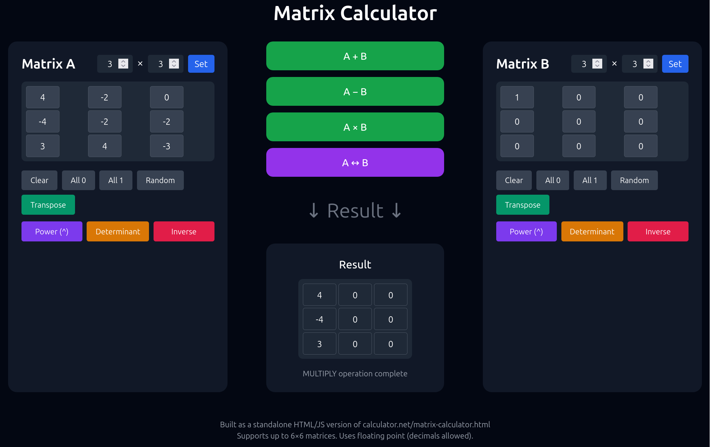

# Matrix Calculator

A beautiful, fully functional **Matrix Calculator** built with pure HTML, CSS, and JavaScript. 


## ✨ Features

- **Add, Subtract, and Multiply** matrices
- **Transpose** matrices
- **Matrix Power** (A^n)
- **Determinant** calculation (for square matrices)
- **Resize** matrices up to **6×6**
- Random matrix generator
- Fill with zeros or ones
- Swap matrices (A ↔ B)
- Clean, modern dark UI with Tailwind CSS
- Fully responsive design
- No dependencies — works offline

## 🚀 Live Demo

[Open Matrix Calculator](https://pdragonlabs.github.io/matrix-calculator/) *(replace with your GitHub Pages link)*

## 📸 Screenshots

*(Add screenshots here)*

## 🛠️ How to Use

1. Clone the repository:
   ```bash
   git clone https://github.com/pdragonlabs/matrix-calculator.git
